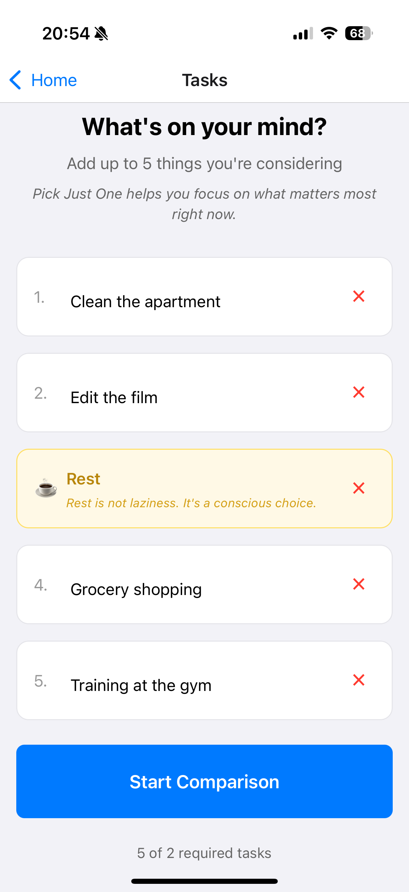
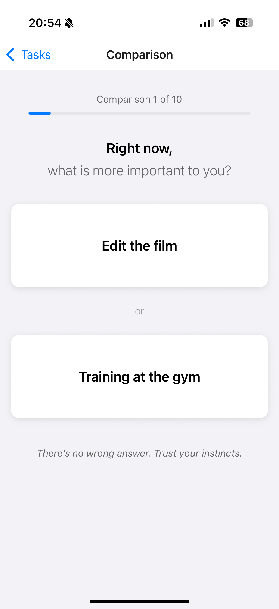
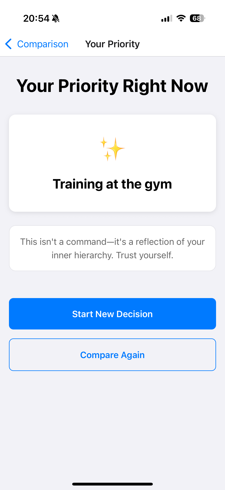

# PickJustOne

**PickJustOne** is a mobile application built with **React Native** and **Expo**.

It was created to help you set priorities and teach you how to make decisions. From several tasks, you choose the one that matters most right now. Then you focus on that one task in silence. You'll thank yourself later!

---

## **Features**

- **Tasks management**:
  - Add / edit / delete tasks (min 2, max 5)
  - Optional **Rest** task (conscious choice to rest)
  - Validation and keyboard-friendly input
- **Pairwise comparison**:
  - Compare tasks in pairs (random order)
  - Progress indicator (e.g. Comparison 2 of 10)
  - Choices stored for result calculation
- **Result**:
  - Winner = task chosen most often
  - Screen “Your priority right now” with the result
  - Start over or run a new comparison
- **UX**:
  - Global state (Zustand) so data is shared between screens
  - Stack navigation (Home → Tasks → Comparison → Result)
  - Reusable UI (Button, Card) and design system (theme)

---

## **Technologies Used**

- **React Native**:  
  Cross-platform mobile UI with native components.
- **Expo**:  
  Toolchain and runtime for building and running the app (Expo Go, EAS).
- **TypeScript**:  
  Type-safe code and better DX.
- **React Navigation (Native Stack)**:  
  Stack-based navigation between screens.
- **Zustand**:  
  Global state for tasks and comparison choices.
- **npm**:  
  Package management and project scripts.

---

## **Screenshots**

### **Tasks Screen**

A simple input screen where you write down up to five tasks that are currently on your mind. This screen helps you capture everything first, without deciding yet what matters most.


### **Comparison Screen**

A focused decision screen where two tasks are shown at a time. You choose which task matters more right now, moving step by step through all comparisons until a clear priority emerges.


### **Result Screen**

A summary screen that shows the outcome of your decisions. The task selected most often becomes your priority for the moment, helping you focus on one thing without guilt or distractions.


---

## **Getting Started**

### **Prerequisites**

### **Installation and Local Development**

1. **Clone the repository**:

```bash
git clone https://github.com/KamilBarczyk/PickJustOne.git
```

2. **Navigate to the project folder:**

```bash
cd PickJustOne
```

3. **Install dependencies:**

```bash
npm install
```

4. **Run the project:**

```bash
npm start
```

Then **scan the QR code** using your phone’s camera app.
If you don’t have the **Expo Go** app installed yet, you’ll need to download it first (iOS/Android).
After that, you will be redirected to Expo Go, where you can run and **enjoy the app**.
